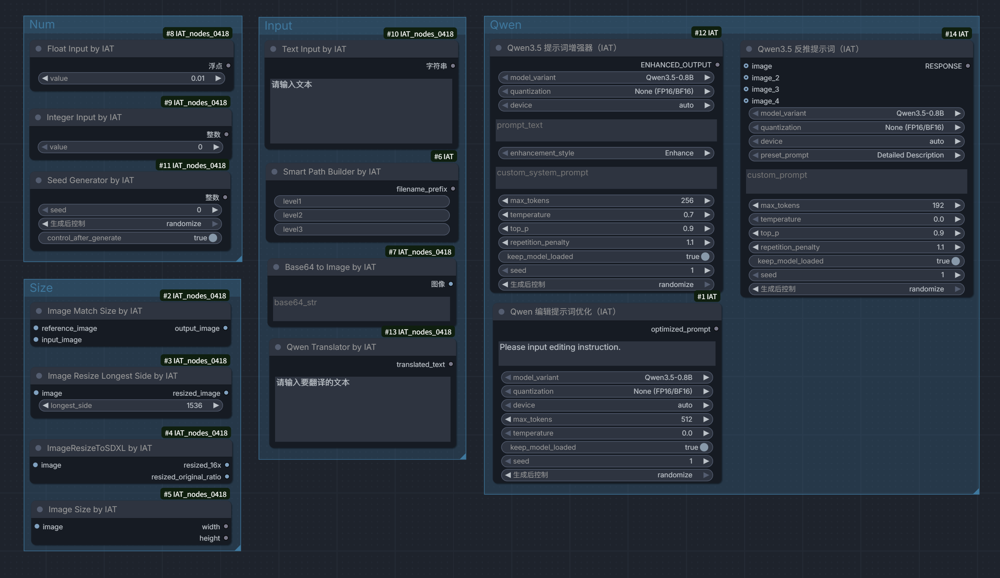

<div align="center">

# 🎨 ComfyUI-IAT

**ComfyUI-IAT v2.0: stable Qwen3.5 text/image utilities for production workflows**

[](https://github.com/Eric7758/ComfyUI-IAT/stargazers)
[](https://github.com/Eric7758/ComfyUI-IAT/network)
[](LICENSE)
[](https://www.python.org/)
[](https://github.com/comfyanonymous/ComfyUI)

[English](#english) | [中文](#中文)



</div>

---

## <a name="english"></a> 🇺🇸 English

### 📌 v2.0 at a glance

- Official Qwen model path only (`Qwen3.5` / `Qwen3.6-35B-A3B`)
- Fixed model directory: `ComfyUI/models/diffusion_models`
- Download strategy: `ModelScope -> HuggingFace`
- No runtime auto-upgrade for dependencies
- Clear production error codes (`E1001`, `E2001`, `E2003`, `E2004`, `E5001`)

### ✨ Features

ComfyUI-IAT provides powerful AI-driven text and image processing nodes for ComfyUI workflows:

| Node | Function | Description |
|------|----------|-------------|
| 📝 **Qwen3.5 Prompt Enhancer** | Prompt Optimization | Enhance your prompts with vivid details and professional quality |
| 🔍 **Qwen3.5 Reverse Prompt** | Image-to-Text | Generate prompts from images using vision-language models |
| 🤖 **Vision API Reverse Prompt** | Image-to-Text | Generate prompts from images through OpenAI-compatible APIs, Gemini, and other vision providers |
| 🌐 **Qwen Translator** | Translation | Translate Chinese/Japanese to natural English |
| ✏️ **Qwen Kontext Translator** | Editing Optimization | Optimize editing instructions for image editing models |
| 🎨 **Image Color Palette Extractor** | Color Analysis | Extract dominant colors and generate a ratio-based palette image |

### 🚀 Quick Start

#### Installation

**Method 1: Using ComfyUI Manager (Recommended)**
1. Open ComfyUI Manager
2. Click "Install Custom Nodes"
3. Search for "ComfyUI-IAT"
4. Click Install

**Method 2: Manual Installation**

```bash
# Navigate to ComfyUI custom nodes directory
cd ComfyUI/custom_nodes

# Clone the repository
git clone https://github.com/Eric7758/ComfyUI-IAT.git

# Install dependencies
cd ComfyUI-IAT
python install.py
```

**Method 3: Using Install Scripts**

```bash
# Windows
install.bat

# Linux/Mac
bash install.sh
```

#### Configuration

Edit `config.yaml` to customize default settings:

```yaml
model:
  default_variant: "Qwen3.5-2B"      # Default model variant
  device: "cuda"                      # Device: cuda, cpu

runtime:
  default_attention_backend: "SDPA"  # SDPA / FlashAttention-2 / Eager
  prefer_optimized_attention: true    # Try FlashAttention2/SDPA first, then fall back automatically
  enable_torch_compile: false         # Conservative default; enable only if your torch/cuda stack is stable
  offline_only: false                 # Skip all downloads and only try local model files

openai:
  base_url: "https://api.openai.com/v1"  # OpenAI or compatible endpoint base URL
  model: "gpt-4.1-mini"                  # Default model for OpenAI-compatible reverse prompt requests
  api_key: ""                            # Optional. Prefer OPENAI_API_KEY env var
  api_key_env: "OPENAI_API_KEY"         # Environment variable name used when api_key is empty
  timeout_seconds: 60                    # HTTP timeout for vision API requests
  user_agent: "ComfyUI-IAT/2.0"         # Override only if your proxy requires a custom client signature

logging:
  verbose: false                      # Enable verbose logging
```

For secrets such as API keys, you can write them directly into `config.yaml`:

```yaml
openai:
  api_key: "sk-your-api-key"
```

Optional provider-specific sections:

```yaml
gemini:
  base_url: "https://generativelanguage.googleapis.com/v1beta"
  model: "gemini-2.5-flash"
  api_key: ""
  api_key_env: "GEMINI_API_KEY"

qwen_compatible:
  base_url: "https://dashscope.aliyuncs.com/compatible-mode/v1"
  model: "qwen-vl-plus"
  api_key: ""
  api_key_env: "DASHSCOPE_API_KEY"
```

### 📖 Usage

Model selection now uses official `model_variant` entries only:
- `Qwen3.5-0.8B`
- `Qwen3.5-2B`
- `Qwen3.5-4B`
- `Qwen3.5-9B`
- `Qwen3.5-27B`
- `Qwen3.6-35B-A3B`

Model download path and fallback are fixed:
- Path: `ComfyUI/models/diffusion_models`
- Source order: `ModelScope -> HuggingFace`

For production troubleshooting with concise error codes and trace IDs, see:
- [docs/TROUBLESHOOTING.md](docs/TROUBLESHOOTING.md)

#### 1. Prompt Enhancement

Use **Qwen3.5 Prompt Enhancer** to improve your prompts:

```
Input: "a girl in forest"
Output: "A young woman standing in a mystical forest, dappled sunlight 
filtering through ancient oak trees, wearing a flowing emerald dress, 
ethereal atmosphere with floating dust particles..."
```

**Enhancement Styles:**
- **Enhance** - Expand with vivid details
- **Refine** - Clear and concise
- **Creative Rewrite** - Stronger visual storytelling
- **Detailed Visual** - Highly detailed description

#### 2. Reverse Prompt (Image-to-Text)

Use **Qwen3.5 Reverse Prompt** to generate prompts from images:

- Upload 1-4 images
- Choose preset or custom prompt
- Get detailed generation prompts

**Presets:**
- **Detailed Description** - Full image description
- **Prompt Reverse** - Compact generation prompt
- **Style Focus** - Style and composition analysis

#### 3. Translation

Use **Qwen Translator** for automatic translation:

- Auto-detects Chinese/Japanese
- Can translate to natural English or Chinese
- Optimized for image generation prompts

#### 4. Vision API Reverse Prompt

Use **Vision API Reverse Prompt** to generate prompts through multiple vision APIs:

- Upload 1-4 images
- Reuse the same reverse prompt presets as the local Qwen node
- Supported providers: `OpenAI-Compatible`, `Gemini`, `Qwen OpenAI-Compatible`
- The node now explains that leaving `api_key` blank will fall back to the matching provider section in `config.yaml`, then that provider's environment variable
- API failures now return clearer reasons such as invalid API key, insufficient balance, invalid URL, timeout, rate limit, and upstream unavailability
- After editing `api_key` / `base_url`, click `refresh_models` to query the provider's `/models` endpoint and select a model from `available_models`
- Supports custom `base_url` for compatible API gateways

#### 5. Editing Optimization

Use **Qwen Kontext Translator** for image editing:

- Optimizes editing instructions
- Produces clean, editable prompts
- Perfect for Kontext-based editing models

### 🛠️ Requirements

- Python 3.8+
- ComfyUI
- PyTorch 2.0+
- Transformers 5.2.0+ (if your build lacks `qwen3_5`, runtime raises `E5001` with a manual fix command)
- 4GB+ VRAM (8GB+ recommended)

### 📦 Model Support

**Qwen3.5 - Native Multimodal Models for Consumer GPUs**

All Qwen3.5 models support **text + image + video** input with **text** output:

| Model | Size | VRAM (FP16/BF16) | Best For |
|-------|------|------------------|----------|
| Qwen3.5-0.8B | ~0.9B | ~2GB | Fast inference, lowest memory |
| Qwen3.5-2B | ~2B | ~5GB | Balanced speed/quality |
| Qwen3.5-4B | ~5B | ~10GB | Better quality on mid-range GPUs |
| Qwen3.5-9B | ~10B | ~20GB | High quality |
| Qwen3.5-27B | ~28B | ~56GB | Best quality |
| Qwen3.6-35B-A3B | ~35B (A3B) | depends on hardware | Large-scale reasoning tasks |

### 📝 Changelog

See [UPDATE.md](UPDATE.md) for detailed changelog.

### 🤝 Contributing

Contributions are welcome! Please feel free to submit issues and pull requests.

### 📄 License

This project is licensed under the MIT License - see [LICENSE](LICENSE) file.

---

## <a name="中文"></a> 🇨🇳 中文

### 📌 v2.0 核心说明

- 仅保留 Qwen 官方原版模型路径（`Qwen3.5` / `Qwen3.6-35B-A3B`）
- 模型目录固定为 `ComfyUI/models/diffusion_models`
- 下载顺序固定为 `ModelScope -> HuggingFace`
- 运行时不再自动升级依赖
- 生产错误码统一（`E1001`、`E2001`、`E2003`、`E2004`、`E5001`）

### ✨ 功能特性

ComfyUI-IAT 为 ComfyUI 工作流提供强大的 AI 驱动的文本和图像处理节点：

| 节点 | 功能 | 描述 |
|------|------|------|
| 📝 **Qwen3.5 提示词增强器** | 提示词优化 | 用生动的细节和专业质量增强提示词 |
| 🔍 **Qwen3.5 反推提示词** | 图像转文本 | 使用视觉语言模型从图像生成提示词 |
| 🤖 **Vision API 反推提示词** | 图像转文本 | 通过 OpenAI 兼容接口、Gemini 等视觉 API 从图像生成提示词 |
| 🌐 **Qwen 翻译器** | 翻译 | 将中文/日文翻译成自然流畅的英文 |
| ✏️ **Qwen 编辑提示词优化** | 编辑优化 | 为图像编辑模型优化编辑指令 |
| 🎨 **图像主色调色板提取器** | 颜色分析 | 提取图片主色并输出按占比绘制的色条图 |

### 🚀 快速开始

> 说明：当前版本的 `requirements.txt` 已包含完整运行依赖（含 `torch/numpy/Pillow`），用于减少不同 ComfyUI 环境下的缺包风险。

#### 安装

**方法 1：使用 ComfyUI Manager（推荐）**
1. 打开 ComfyUI Manager
2. 点击 "Install Custom Nodes"
3. 搜索 "ComfyUI-IAT"
4. 点击安装

**方法 2：手动安装**

```bash
# 进入 ComfyUI 自定义节点目录
cd ComfyUI/custom_nodes

# 克隆仓库
git clone https://github.com/Eric7758/ComfyUI-IAT.git

# 安装依赖
cd ComfyUI-IAT
python install.py
```

**方法 3：使用安装脚本**

```bash
# Windows
install.bat

# Linux/Mac
bash install.sh
```

#### 配置

编辑 `config.yaml` 自定义默认设置：

```yaml
model:
  default_variant: "Qwen3.5-2B"      # 默认模型版本
  device: "cuda"                      # 设备: cuda, cpu

runtime:
  default_attention_backend: "SDPA"   # SDPA / FlashAttention-2 / Eager
  prefer_optimized_attention: true    # 优先尝试 FlashAttention2/SDPA，失败时自动回退
  enable_torch_compile: false         # 保守默认值；仅在 torch/cuda 环境稳定时开启
  offline_only: false                 # 跳过所有下载，仅尝试本地模型文件

openai:
  base_url: "https://api.openai.com/v1"  # OpenAI 或兼容接口根地址
  model: "gpt-4.1-mini"                  # OpenAI 兼容反推请求的默认模型
  api_key: ""                            # 可选。更推荐使用环境变量
  api_key_env: "OPENAI_API_KEY"         # 当 api_key 为空时读取的环境变量名
  timeout_seconds: 60                    # 视觉 API 请求超时时间（秒）
  user_agent: "ComfyUI-IAT/2.0"         # 仅当代理网关要求自定义客户端标识时再修改

logging:
  verbose: false                      # 启用详细日志
```

对于 API Key 这类信息，可以直接写入 `config.yaml`：

```yaml
openai:
  api_key: "sk-your-api-key"
```

也可以按 provider 增加可选配置段：

```yaml
gemini:
  base_url: "https://generativelanguage.googleapis.com/v1beta"
  model: "gemini-2.5-flash"
  api_key: ""
  api_key_env: "GEMINI_API_KEY"

qwen_compatible:
  base_url: "https://dashscope.aliyuncs.com/compatible-mode/v1"
  model: "qwen-vl-plus"
  api_key: ""
  api_key_env: "DASHSCOPE_API_KEY"
```

### 📖 使用方法

模型选择仅保留官方原版 `model_variant`：
- `Qwen3.5-0.8B`
- `Qwen3.5-2B`
- `Qwen3.5-4B`
- `Qwen3.5-9B`
- `Qwen3.5-27B`
- `Qwen3.6-35B-A3B`

模型下载目录和顺序固定为：
- 目录：`ComfyUI/models/diffusion_models`
- 下载顺序：`ModelScope -> HuggingFace`

生产排障与错误码说明见：
- [docs/TROUBLESHOOTING.md](docs/TROUBLESHOOTING.md)

#### 1. 提示词增强

使用 **Qwen3.5 提示词增强器** 改进提示词：

```
输入: "森林中的女孩"
输出: "一位年轻女子站在神秘的森林中，斑驳的阳光透过古老的橡树，
身着飘逸的翡翠色长裙，空灵的氛围中漂浮着尘埃颗粒..."
```

**增强风格：**
- **Enhance** - 扩展生动细节
- **Refine** - 清晰简洁
- **Creative Rewrite** - 更强的视觉叙事
- **Detailed Visual** - 高度详细描述

#### 2. 反推提示词（图像转文本）

使用 **Qwen3.5 反推提示词** 从图像生成提示词：

- 上传 1-4 张图像
- 选择预设或自定义提示词
- 获取详细的生成提示词

**预设选项：**
- **Detailed Description** - 完整图像描述
- **Prompt Reverse** - 紧凑生成提示词
- **Style Focus** - 风格和构图分析

#### 3. 翻译

使用 **Qwen 翻译器** 进行自动翻译：

- 自动检测中文/日文
- 可选择翻译为自然流畅的英文或中文
- 针对图像生成提示词优化

#### 4. Vision API 反推提示词

使用 **Vision API 反推提示词** 通过多种视觉 API 从图像生成提示词：

- 上传 1-4 张图像
- 复用与本地 Qwen 反推节点相同的预设提示词
- 当前支持：`OpenAI-Compatible`、`Gemini`、`Qwen OpenAI-Compatible`
- 节点中已提示：留空 `api_key` 时会优先回退到 `config.yaml` 中对应 provider 的配置，再回退到该 provider 的环境变量
- API 调用失败时会尽量返回明确原因，例如无效 API Key、额度不足、无效 URL、超时、限流、上游不可用
- 修改 `api_key` / `base_url` 后，可点击 `refresh_models` 查询该服务的 `/models` 并在 `available_models` 中选择
- 支持自定义 `base_url`，方便接入兼容网关

#### 5. 编辑优化

使用 **Qwen 编辑提示词优化** 进行图像编辑：

- 优化编辑指令
- 生成清晰、可编辑的提示词
- 完美适配基于 Kontext 的编辑模型

### 🛠️ 系统要求

- Python 3.8+
- ComfyUI
- PyTorch 2.0+
- Transformers 5.2.0+（若当前安装包不识别 `qwen3_5`，运行时会报 `E5001` 并给出手动修复命令）
- 4GB+ 显存（建议 8GB+）

### 📦 模型支持

**Qwen3.5 - 面向消费级显卡的原生多模态模型**

所有 Qwen3.5 模型都支持**文本 + 图像 + 视频**输入，**文本**输出：

| 模型 | 参数量 | FP16/BF16 显存 | 适用场景 |
|------|--------|----------------|----------|
| Qwen3.5-0.8B | ~0.9B | ~2GB | 快速推理、最低内存 |
| Qwen3.5-2B | ~2B | ~5GB | 速度与质量平衡 |
| Qwen3.5-4B | ~5B | ~10GB | 中高端显卡更好质量 |
| Qwen3.5-9B | ~10B | ~20GB | 高质量 |
| Qwen3.5-27B | ~28B | ~56GB | 最佳质量 |
| Qwen3.6-35B-A3B | ~35B (A3B) | 取决于硬件 | 大规模推理任务 |

### 📝 更新日志

查看 [UPDATE.md](UPDATE.md) 获取详细更新日志。

### 🤝 贡献

欢迎贡献！请随时提交问题和拉取请求。

### 📄 许可证

本项目采用 MIT 许可证 - 查看 [LICENSE](LICENSE) 文件。

---

## 🙏 Acknowledgments

- [ComfyUI](https://github.com/comfyanonymous/ComfyUI) - The powerful node-based UI for Stable Diffusion
- [Qwen](https://github.com/QwenLM/Qwen) - Alibaba's large language model series
- [ModelScope](https://www.modelscope.cn/) - Model hosting platform

---

<div align="center">

**⭐ Star this repo if you find it helpful! ⭐**

</div>
